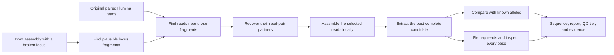

# Locus-Recon

**Recover sequence and copy-number evidence for a bacterial locus from the
short reads you already have.**

Locus-Recon was developed for a common gap between bacterial assemblies and the
questions asked of them. A typing locus may be split between contigs. Related
copies may collapse into a truncated or mosaic sequence. An amplified
resistance gene may retain the same allele while its dosage changes markedly.
In each case, the original paired-end Illumina reads can contain information
that is no longer visible in the assembled FASTA.

The standard workflow uses curated alleles to find and delimit one target
locus. It recruits overlapping read pairs and their mates, assembles them
locally and remaps the reads to record support at every reconstructed base. The
sample reads determine the reported sequence. The bait set provides search
coordinates and comparison, not replacement bases.

Evidence is reported on axes that answer different questions and are not
mixed. Read support and internal coherence set the confidence tier. Whether the
reported sequence is complete is measured separately, because per-base
statistics describe the bases that were reported and cannot describe bases that
were never reported. The full locus span is projected onto the contig carrying
it, any shortfall at a contig end is reported in bases, and a neighbouring
contig holding the missing part is named. Distance to the nearest curated allele
is reported on a third axis and does not constrain the tier, so a
well-supported reconstruction from an under-represented lineage is annotated for
curation rather than downgraded.

Two companion commands address copy number. The depth module compares locus
coverage with a single-copy genomic background and reports a continuous dosage
only when the mapped query geometry permits that interpretation. The consensus
module adds the number of distinct flanking contexts retained in a SPAdes graph.
Depth and graph evidence remain separate, so disagreement is reported rather
than hidden by rounding or correction.

The validation datasets have different purposes.

- A deterministic mock tests exact reconstruction and safe refusal when the
  target is fragmented, weakly supported, mixed, paralogous or absent.
- A constructed one-copy to three-copy series tests the calibrated depth
  estimator across sequencing depth and GC conditions.
- A constructed 14-case series tests the completeness measurement against known
  truncation and split geometries. Measured shortfall equalled constructed truth
  in all fourteen cases, and the reconstruction itself was byte-identical to
  what the workflow reports with the check disabled.
- Seven *Acinetobacter baumannii* runs test whether depth recovers real
  amplification of the aminoglycoside resistance gene *aphA1*. All four
  single-copy and three amplified classifications agreed with published
  evidence. Estimates of 10.451 and 77.672 fell within qPCR intervals of 10 ± 2
  and 75 ± 14 copies.
- Five hybrid-closed *Helicobacter pylori* genomes test the low-copy boundary
  on real reads. Each has two 23S rRNA copies and one *gyrB* copy, and graph
  evidence recovered two and one contexts respectively while the 23S depth
  ratios remained above the two-copy expectation. This panel informed
  graph-method development and is not claimed as held-out validation.
- The same five genomes, whose closed sequences are known, audit the
  reconstruction and its confidence layer against truth. Nine of ten
  reconstructions matched the closed sequence base for base; the tenth was
  reported as truncated with the missing 317 bp located on a named scaffold. All
  five *gyrB* reconstructions were exact while sitting 96.2-96.7% from the
  single catalogue reference, which is the case the separated catalogue axis
  exists for.
- The *Clostridioides difficile* LIBA-6656 analysis applies reconstruction,
  graph, competitive mapping and genomic-context evidence to divergent *tcdB*
  candidates. It also shows why the additive dosage is not a copy count when
  discovery spans overlap, because a matched control on single-copy sequence
  returns the same value.

See [validation evidence](#validation-evidence) for the numerical results and
their limits. One run targets one locus in one or many samples. If you already
have an assembly, its paired reads and a curated allele set, begin with
[installation with Conda](#installation-with-conda) and then follow the
[quick start](#quick-start).

This is release 1.0.0. The [changelog](CHANGELOG.md) lists what the release
contains, and [`CITATION.cff`](CITATION.cff) holds the citation metadata.

## Find the information you need

| If you want to... | Start here |
|---|---|
| Understand the problem without bioinformatics background | [The idea in plain language](#the-idea-in-plain-language) |
| Decide whether your data are suitable | [Is Locus-Recon appropriate for my data?](#is-locus-recon-appropriate-for-my-data) |
| Install the software and dependencies | [Installation with Conda](#installation-with-conda) |
| Check the installation and run the tool | [Quick start](#quick-start) |
| Understand a result | [Read the results](#read-the-results) |
| Find out how many copies of the locus an isolate carries | [Depth and graph-context copy number](#when-every-copy-is-identical-the-depth-ratio) |
| Find out whether a reported allele is complete | [When the locus runs off the end of a contig](#when-the-locus-runs-off-the-end-of-a-contig) |
| Recover a sequence the local assembler collapsed | [When the local assembly collapses a repeat](#when-the-local-assembly-collapses-a-repeat) |
| Interpret every file, column, QC tier, or flag | [Output and interpretation reference](docs/output-interpretation.md) |
| See every command-line option and default | [Command-line reference](docs/cli-reference.md) |
| Resolve an error or unexpected result | [Troubleshooting guide](docs/troubleshooting.md) |
| Review the computational method and validation design | [Methods and validation guide](docs/validation.md) |

## The idea in plain language

### Six terms used throughout this guide

| Term | Meaning here |
|---|---|
| **Locus** | The particular gene or defined DNA region you want to recover. Multilocus sequence typing (MLST) and core-genome MLST (cgMLST) schemes type isolates using predefined loci. |
| **Allele** | One observed sequence version of that locus. |
| **Draft assembly** | A FASTA file containing reconstructed genome fragments, usually called contigs. |
| **Contig break** | A place where the assembler could not join the genome sequence. A locus can be split across this break. |
| **Paired-end reads** | The original Illumina R1 and R2 sequences. The two reads in a pair come from opposite ends of the same DNA fragment and can help bridge a break. |
| **Bait alleles** | A FASTA file of known sequences for the requested locus. Locus-Recon uses them as search references and as an expected-length/composition profile. |

### What a split locus looks like

```text
Expected locus:       |================ full locus ================|

Draft contig A:   -----------|====================
Draft contig B:                               ================|----------
                                       contig break ^

Matched read pairs:      >>>>>>>>>>>>>>>>>>>>>>>>>>>>>>>>>>>>
Mate rescue:        <<<<<<<<                          >>>>>>>>>
Local assembly:         |================ full locus ================|
```

The known alleles first identify plausible locus fragments on contig A, contig
B, or both. Reads overlapping those regions are selected. Their paired mates are
also recovered, including mates that extend across the missing join. SPAdes then
assembles only this reduced read set. Locus-Recon extracts the best-supported
locus candidate and checks it by similarity, read remapping, per-base depth,
read quality, strand balance, sequence structure, mixture evidence, and
competition from other distinct local regions.



## Is Locus-Recon appropriate for my data?

Use Locus-Recon when all of the following are true:

- you have a bacterial draft assembly in FASTA format;
- you have both R1 and R2 Illumina reads for the same isolate, ideally the exact
  reads used to create that assembly;
- one defined MLST, cgMLST, or comparable locus is incomplete or missing from
  the assembly;
- you have a curated FASTA of known alleles for that one locus; and
- assembly fragmentation is a plausible explanation for the missing call.

The program can process many isolates in one batch, but it reconstructs only the
one locus named with `--locus` during that invocation. Run independent commands
for additional loci.

Locus-Recon does not currently use:

- long reads as reconstruction input;
- metagenomic samples;
- samples for which only unpaired reads are available; or
- a whole-genome contamination or mixed-isolate model.

A `SKIP` or no-detection result does not by itself prove that the locus is
biologically absent. Other explanations include a divergent target, very low
read depth, an unresolved repeat, unsuitable bait alleles, or a sample/assembly
mismatch.

### Where it sits among related tools

Locus-Recon is not an allele caller and does not replace one. Read-based
callers such as SRST2, stringMLST and KMA return the best-matching allele of a
catalogue together with its support. ARIBA assembles reads locally against
clustered references and reports genes and variants relative to them. Kaptive
types a curated locus from an assembly. Each of these answers which known entry
a sample matches, and none of them reports the copy number of the locus.

Locus-Recon answers a different question. It takes the assembly and the reads
together, returns the locus sequence itself with resolved boundaries, a
per-base decision ledger and a confidence tier, and reports the depth of the
locus against a single-copy backbone with a bootstrap interval and a
length-weighted copy estimate. The cost of that scope is curation. Every locus
needs curated baits, a boundary definition and its own validation set, and
Locus-Recon ships neither a locus catalogue nor an automated curation
pipeline.

## What the tool produces

For a batch, Locus-Recon creates:

- one tab-separated report with a row for every sample;
- one combined FASTA containing every reconstruction that passed the minimum
  `SUCCESS` gates;
- a human-readable QC report and retained evidence for each successful sample;
- per-base read support for every successful reconstructed sequence;
- the completeness of each reported allele, meaning the shortfall in bases
  where the projected locus runs past the end of its contig, and the
  neighbouring contig carrying the missing part when the local assembly
  contains it;
- logs that distinguish expected no-result conditions from execution failures;
  and
- a JSON manifest recording parameters, input metadata, checksums, software
  paths, and detected versions.

The output is designed for scientific review, prioritization, and downstream
curation. It is not an automatic allele-submission system.

## Installation with Conda

The commands below are entered in a **terminal**. Linux, macOS, or a Linux
environment such as WSL is recommended because the workflow depends on standard
command-line bioinformatics software. The project tests Python behavior on
Linux, and the bundled reference workflow was generated on macOS.

### 1. Install Conda if needed

If `conda --version` already works, continue to the next step. Otherwise install
[Miniforge](https://github.com/conda-forge/miniforge), which provides both Conda
and the faster Mamba solver. Reopen the terminal after installation and confirm
that Conda is available:

```bash
conda --version
```

### 2. Download and install Locus-Recon

If `git --version` works, clone the repository:

```bash
git clone https://github.com/crodsa/locus-recon.git
cd locus-recon
```

If you do not use Git, download GitHub's **Code → Download ZIP**, extract it,
and open a terminal in the extracted `locus-recon-main` directory.

From the repository root, create the pinned environment, activate it, and
install the Locus-Recon Python package:

```bash
conda env create --file environment.yml
conda activate locus-recon
python -m pip install .
```

The environment name is `locus-recon`. The first command reads the
[`environment.yml`](environment.yml) file in the repository root and installs
the exact Python, BLAST+, BWA-MEM2, samtools, SPAdes, pip, and `tqdm` versions
recorded there. Installing the local Python package is a separate final step so
that the same environment file can be used from a source checkout or a release
archive.

Mamba can perform the environment-resolution step faster. If it is available,
the equivalent installation is:

```bash
mamba env create --file environment.yml
conda activate locus-recon
python -m pip install .
```

### 3. Verify the installation

Keep the environment active and run:

```bash
locus-recon --version
blastn -version
bwa-mem2 version
samtools --version
spades.py --version
```

The first command should report `locus-recon 1.0`; the remaining commands
confirm that all external programs are available inside the active environment.
The package supports Python 3.9 or newer, although the supplied environment pins
Python 3.11.13. See the
[installation and dependency reference](docs/cli-reference.md#installation-and-dependencies)
for the complete dependency list and platform notes.

Every new terminal session must reactivate the environment before using the
tool:

```bash
conda activate locus-recon
```

## Quick start

Complete the [Conda installation](#installation-with-conda) first and keep the
`locus-recon` environment active.

### Confirm the installation without reconstructing reads

The repository includes a deterministic mock dataset. This command checks the
input files, executables, bait database, and provenance manifest, but does not
map or assemble reads:

```bash
locus-recon \
  --samplesheet validation/mock_dataset/samples.tsv \
  --main-output-dir validation/mock_dry_run \
  --bait validation/mock_dataset/mock_locus_alleles.fasta \
  --locus mockLocus \
  --threads 2 \
  --dry-run
```

A successful check ends with `Dry run passed`. You can remove
`validation/mock_dry_run` after reviewing its log and manifest, or keep it as an
installation record.

## Prepare your own inputs

You need four kinds of information.

| Input | Typical extension | What it contains |
|---|---|---|
| Draft assembly | `.fasta`, `.fa`, or `.fna` | One or more assembled contigs for one isolate. |
| Forward reads | `_R1.fastq.gz` or `_R1.fq.gz` | The first read from each Illumina pair. |
| Reverse reads | `_R2.fastq.gz` or `_R2.fq.gz` | The matching second reads for the same isolate. |
| Bait allele set | `.fasta` or `.fa` | Curated known alleles for one locus, all in a consistent orientation. |

### Bait allele FASTA

Obtain the allele sequences from the authoritative provider of the exact typing
scheme you are using. For example, a [PubMLST](https://pubmlst.org/) scheme
normally provides a sequence definition for each locus. Record the scheme name
and database release or download date in your study metadata.

The file must contain only one locus, although it should normally contain many
known alleles for that locus. All records must use the same biological start
and end boundaries and the same orientation:

```text
>target_locus_1
ATG...GCT
>target_locus_2
ATG...GTT
>target_locus_3
ATG...GCC
```

The dots above abbreviate the example. Real FASTA records must contain the full,
uninterrupted DNA sequence; do not include `...` in the file.

Locus-Recon treats the first whitespace-delimited token after `>` as the record
ID. That token must be unique, non-empty, contain valid IUPAC DNA symbols, and
be at most 50 characters long, which is the limit `makeblastdb -parse_seqids`
imposes on a local identifier. Each of those four conditions is checked before
any external program runs, and each failure names the offending record and what
to change:

| Input problem | What you are told |
| --- | --- |
| Alignment gaps (`-`, `.`) in a record | The symbols found, plus that the file looks like a gapped alignment rather than an allele set and the gaps must be removed |
| An identifier longer than 50 characters | Its length, the `-parse_seqids` limit, and that the text before the first space must be shortened |
| A duplicated or empty record | The record ID |
| Records that share no 25-mer with the full-length records of the set | A warning naming them as probable paralogues or unrelated fragments; the run continues |

The last check is a warning rather than an error because a short, genuinely
divergent allele is possible, but in practice a record with no k-mer in common
with the rest of the set is a fragment of a different gene family member. It is
compared against the records at least half the length of the longest one, so
two paralogous fragments cannot vouch for each other.

Consistent orientation remains good practice, but it is no longer a silent
trap: reading-frame metrics are computed over all six frames (see
[reading frame](#reading-frame-metrics-are-computed-over-six-frames)), and a
bait set that reads as coding only on the reverse strand is reported as such.
Whether the file contains the correct biological locus and shared biological
boundaries cannot be determined by the tool; those remain scheme-curation
responsibilities.

Do not mix different loci or known paralogs in one bait file.

If the target is not protein-coding, an rRNA gene or an intergenic definition
for instance, add `--noncoding-locus` to the run. Locus-Recon then stops
checking the candidate for internal stop codons and for a length consistent
with the bait reading frame, checks that would otherwise flag a perfectly good
non-coding reconstruction as suspect.

### Reading frame metrics are computed over six frames

A reconstruction inherits the orientation of the bait that recruited it. When a
bait catalogue is supplied antisense to the coding strand, which is common for
records cut from a genome in the orientation the assembly happened to use, a
forward-only stop-codon count describes the wrong strand and reports stop
codons the reconstruction does not have.

`internal_stops` is therefore the minimum over all six reading frames, and
`qc_coding_frame_used` names the frame that achieved it (`+1`..`+3`, `-1`..`-3`).
The start and stop codon checks read the sequence in that same frame. A bait set
whose plausible frames are all on the reverse strand is reported at the start of
the run as a warning, not an error, because the six-frame scan has already made
it harmless.

An interior run of N is a second source of stop codons that say nothing about
the reported bases. The local assembler writes that run when it scaffolds
across a gap it cannot spell, and when its length is not a multiple of three
every codon downstream of it is shifted. `internal_stops` is therefore also
recomputed with the interior placeholders excised and reported as
`qc_internal_stops_placeholder_closed`. When the count falls, the descriptive
flag `PLACEHOLDER_FRAMESHIFT_EXPLAINS_STOPS` gives both numbers.
`INTERNAL_STOPS` is still raised, because the sequence as delivered does
contain them, but the report now distinguishes a frameshifted scaffold from a
damaged reconstruction. Read it with `placeholder_junction_support`: a
graph-supported junction whose excision removes every stop describes a
scaffolding artefact, not a pseudogene.

`FRAME_LENGTH_SHIFT` compares the candidate length modulo three with the bait's
modal value. A reconstruction that a contig boundary has truncated has no reason
to be a multiple of three, and that truncation is already reported by
`ALLELE_SPAN_CLIPPED_AT_CONTIG_END` and measured by `span_clipped_bp`. When the
projected span is clipped, the flag is therefore issued as
`FRAME_LENGTH_SHIFT_TRUNCATED` and treated as descriptive, so the same fact is
not scored twice as evidence about sequence integrity.

### Samplesheet

Create a tab-separated text file with four columns. The header is optional, but
including it makes the file easier to inspect:

```tsv
sample_id	assembly_path	r1_path	r2_path
isolate_001	data/isolate_001.fasta	reads/isolate_001_R1.fastq.gz	reads/isolate_001_R2.fastq.gz
isolate_002	data/isolate_002.fasta	reads/isolate_002_R1.fastq.gz	reads/isolate_002_R2.fastq.gz
```

Important details:

- columns must be separated by tabs, not spaces or commas;
- sample IDs must be unique, begin with a letter or number, and contain only
  letters, numbers, dots, underscores, or hyphens;
- blank lines and lines beginning with `#` are ignored; and
- relative paths are resolved from the directory containing the samplesheet,
  not from the terminal's current directory.

One simple study layout is:

```text
study/
├── target_locus_alleles.fasta
├── samples.tsv
├── data/
│   ├── isolate_001.fasta
│   └── isolate_002.fasta
└── reads/
    ├── isolate_001_R1.fastq.gz
    ├── isolate_001_R2.fastq.gz
    ├── isolate_002_R1.fastq.gz
    └── isolate_002_R2.fastq.gz
```

An editable template is available at
[`examples/samplesheet.tsv`](examples/samplesheet.tsv).

## Run your reconstruction

### 1. Validate the setup

Replace `target_locus` with the exact safe name you want in output filenames.
Run from the repository directory, or use absolute paths:

```bash
locus-recon \
  --samplesheet study/samples.tsv \
  --main-output-dir results/target_locus \
  --bait study/target_locus_alleles.fasta \
  --locus target_locus \
  --dry-run
```

The dry run still creates the output directory, shared bait BLAST database,
batch log, and `run_manifest.json`. It does not process sample reads.

### 2. Run the batch

For a first real run, keep the default of one sample at a time and retain all
intermediate evidence:

```bash
locus-recon \
  --samplesheet study/samples.tsv \
  --main-output-dir results/target_locus \
  --bait study/target_locus_alleles.fasta \
  --locus target_locus \
  --threads 8 \
  --parallel-samples 1 \
  --memory-per-sample 16
```

After you have validated the workflow for your study, `--cleanup` can remove
bulky per-sample BAM, FASTQ, index, and SPAdes files after each successful
sample while preserving the final sequence and principal evidence summaries.
The [CLI reference](docs/cli-reference.md#cleanup-and-reruns) lists the exact
behavior.

### Run samples in parallel

```bash
locus-recon \
  --samplesheet study/samples.tsv \
  --main-output-dir results/target_locus \
  --bait study/target_locus_alleles.fasta \
  --locus target_locus \
  --threads 8 \
  --parallel-samples 2 \
  --memory-per-sample 16 \
  --cleanup
```

Resource planning is multiplicative:

- maximum logical CPUs ≈ `--threads × --parallel-samples`;
- maximum SPAdes memory allowance ≈ `--memory-per-sample × --parallel-samples`;
  and
- additional operating-system and mapping overhead is still required.

The example therefore permits approximately 16 logical CPUs and 32 GB of
SPAdes memory. Full-read mapping and BAM sorting usually account for most disk
I/O. See [resource planning](docs/cli-reference.md#resource-planning) before
running a large batch or submitting an HPC job.

## How Locus-Recon works

For each sample, the implemented workflow performs seven stages.

1. **Describe the known allele set.** The bait FASTA is summarized by length,
   GC content, length modulo three, and plausible coding frames. These
   distributions provide context for later QC.
2. **Find plausible fragments.** BLASTN aligns the known alleles to the draft
   assembly. Discovery accepts sufficiently similar, sufficiently long partial
   alignments; it does not require one contig to cover most of an allele. Each
   passing region is padded and clipped to its contig boundaries. The full bait
   span is also projected onto the contig, so sequence that falls outside the
   contig is measured as a shortfall rather than silently absent from the
   result.
3. **Retrieve the relevant read pairs.** BWA-MEM2, or BWA as a fallback, maps
   all paired reads to the draft. Reads overlapping target regions seed a set of
   names, and all alignments sharing those names are recovered to rescue their
   partners. Paired reads and surviving singletons are retained.
4. **Assemble locally.** SPAdes assembles only the selected reads. If standard
   SPAdes reports the specific low/non-uniform k-mer histogram failure handled
   by the workflow, Locus-Recon retries that sample in single-cell mode and
   records the strategy in `spades_mode`.
5. **Select and extract a candidate.** Known alleles are aligned to the local
   scaffolds. Redundant hits from different bait alleles that overlap the same
   local region are collapsed before distinct regions compete. The best region
   is ranked by bitscore, query coverage, identity, and aligned length. Unaligned
   bait ends are projected onto the local scaffold to estimate full locus
   boundaries, and reverse-strand candidates are reverse-complemented.
6. **Validate independently.** The extracted candidate is searched against the
   batch's known-allele BLAST database. The extracted paired and singleton reads
   are then remapped to the candidate. A result reaches `SUCCESS` only if it
   passes the configured final identity, query-coverage, mean-depth, and
   breadth gates.
7. **Explain the evidence.** A quality-filtered pileup records every candidate
   position, including zero-depth positions. Locus-Recon evaluates depth,
   patchiness, base and mapping quality, forward/reverse balance, alternative
   alleles, strand bias, possible mixtures, length, composition, coding-frame
   behavior, and competition from another distinct local region. These checks
   assign `HIGH`, `MEDIUM`, `LOW`, or `SUSPECT` sequence confidence and provide
   explicit flags. A shortfall measured in stage 2 is carried here as its own
   evidence class. It blocks `HIGH` on its own, and where the missing interval
   is found on another local contig the result is treated as severe, because
   sequence the data demonstrably contains was left out.
   The reconstruction's distance from the nearest curated allele
   is reported separately as `catalogue_status`: once a candidate has cleared the
   discovery similarity requirement, divergence from the catalogue annotates the
   result for curation instead of reducing its confidence.

The [methods and validation guide](docs/validation.md) gives a methods-style
description, limitations, manual review checklist, and recommended benchmark
design.

## Read the results

Start with these files in this order:

1. `locus_recon_report_<locus>.tsv`, one summary row per input sample;
2. `<locus>_accepted_alleles.fasta`, only `PASS` candidates (`SUCCESS` +
   `HIGH`), with separate `review_required`, `hold`, and all-candidate FASTAs;
3. `<sample>/<sample>_<locus>_qc_report.txt`, the readable scorecard for one
   successful reconstruction;
4. `<sample>/allele_remap.support.tsv`, one evidence row per reconstructed
   position; and
5. `run_manifest.json`, holding parameters, checksums, paths, versions, and input
   metadata for the run.

### Seven fields that answer different questions

| Field | Question it answers | Correct interpretation |
|---|---|---|
| `workflow_status` | Did the sample complete the minimum reconstruction workflow? | `SUCCESS` passed the final identity, coverage, mean-depth, and breadth gates. `SKIP` is an expected no-result condition. `FAIL` is an input, dependency, command, or unexpected execution failure. The legacy `status` column is an identical compatibility alias. |
| `sequence_confidence` | Are the reported bases supported by the read evidence, internally coherent, and spanning the complete locus? | `HIGH`, `MEDIUM`, `LOW`, or `SUSPECT`; populated only after `SUCCESS`. It is stricter than `status`. `qc_confidence` is an identical compatibility alias. Distance from the nearest catalogue allele does not enter this tier. |
| `catalogue_status` | How does the sequence relate to the supplied catalogue? | `EXACT_MATCH`, `NONEXACT_MATCH` (≥97% but not exact), `DIVERGENT_FROM_REFERENCE` (85 to 97%), or `HIGHLY_DIVERGENT_FROM_REFERENCE` (<85%). Reported alongside `nearest_allele_identity_pct` and `catalogue_review_recommended`; independent of `sequence_confidence`. |
| `result_disposition` | Is the candidate ready for routine downstream use? | `PASS` only for `SUCCESS` + `HIGH`; `REVIEW` for `MEDIUM`/`LOW`; `HOLD` for `SUSPECT`, `SKIP`, or `FAIL`. |
| `exact_known_allele` | Is this exactly a sequence already present in the bait database? | `true` requires 100% identity, 100% query coverage, and equal aligned, query, and subject lengths. |
| `mixture_detected` | Do the recruited locus reads support more than one sequence state? | `true` requires the configured number of quality-filtered, bidirectionally supported mixed positions. It is not a genome-wide mixture test. |
| `qc_flags` | Why was confidence downgraded? | Semicolon-separated evidence labels; an empty value accompanies `HIGH` confidence. |

### What action should I take?

| Result | Meaning | Recommended action |
|---|---|---|
| `SUCCESS` + `HIGH` | Minimum gates and all strict QC checks passed. | Confirm provenance, upstream sample QC, locus boundaries, and scheme rules. Visually review any novel or submission-bound sequence. |
| `SUCCESS` + `MEDIUM` | A modest deviation in the read or sequence evidence, or a length difference from the bait profile, was detected. | Review the named flags and per-base evidence before using the sequence. |
| `SUCCESS` + `LOW` | Multiple moderate deviations were detected. | Treat as unresolved until the local assembly and read evidence have been inspected. |
| `SUCCESS` + `SUSPECT` | Severe weakness, ambiguity, mixture, frame disruption, or anomalous evidence was detected. | Do not use as a definitive allele call without further investigation or independent confirmation. |
| `SKIP` | The sample reached an expected no-result condition, such as no bait-supported contig, insufficient recruited reads, no local scaffold, or failure of a final evidence gate. | Read `message`, the per-sample log, and the evidence produced before the skip. Do not interpret it automatically as biological absence. |
| `FAIL` | An input, external command, dependency, or unexpected software step failed. | Correct the execution problem before interpreting the sample biologically. |

Only `PASS` reconstructions are written to `<locus>_accepted_alleles.fasta`.
`REVIEW` and `HOLD` candidates remain recoverable in explicitly named FASTAs,
and `<locus>_reconstructed_candidates.fasta` retains every successful
reconstruction for audit. The legacy `<locus>_reconstructed_alleles.fasta`
path is a compatibility alias of the PASS-only accepted collection.

The [output and interpretation reference](docs/output-interpretation.md)
documents the complete directory tree, every report column, every QC flag
family, and practical review paths for exact, novel-looking, ambiguous,
low-support, and mixed results.

## What the evidence can and cannot show

Locus-Recon can provide:

- a sample-derived candidate sequence for a targeted locus;
- its nearest known bait allele and whether the match is exact;
- read-remapping support at every reconstructed base;
- explicit evidence of weak coverage, ambiguity, strand artifacts, or a
  possible locus-level mixture; and
- a reproducible record of inputs, parameters, versions, and outputs.

Locus-Recon alone cannot:

- prove that a locus is biologically absent after a negative result;
- prove orthology solely from BLAST similarity;
- resolve repeats longer than the informative library span;
- perform whole-genome contamination or mixed-isolate detection;
- phase or reconstruct the component alleles of a mixture;
- replace long-read, hybrid-assembly, targeted-sequencing, or laboratory
  confirmation when a result changes a scientific conclusion; or
- decide whether a scheme provider will accept a new allele.

## When every copy is identical, the depth ratio

Locus-Recon adjudicates copy structure from *allelic* evidence, meaning
bidirectionally
supported mixed sites, frame anomalies, graph branches. That evidence is silent
when the copies are identical to each other. A tandem amplification of a
resistance gene produces no mixed site at all, yet it is emphatically not a
single-copy locus, and the phenotype often depends on how many copies are
present.

The only signal short reads leave in that case is depth. `locus-recon-depth-ratio`
compares depth over the locus with depth over a single-copy backbone, using the
same Q20/MQ20 filters as the per-base evidence table:

```bash
locus-recon-depth-ratio --bam reads_vs_draft.sorted.bam --locus contig_7:250422-251237 --exclude plasmid_1 --tsv locus_depth.tsv
```

The BAM is the one the standard workflow already produced during read
recruitment; no realignment is needed. The command reports the ratio with a
block-bootstrap confidence interval and an `ambiguity_index`. Passing the draft
assembly with `--reference` adds the locus GC content as a descriptive field.

Two questions are kept apart on purpose:

- **Did this locus collapse?** That is what the ratio answers. Reads from every
  physical copy pile onto the single representative the assembler kept, so the
  ratio rises above one. A locus whose copies the assembler managed to separate
  shows no pile-up, and a ratio near one is then the correct answer to the
  question the ratio asks.
- **What total dosage is supported?** That is `dosage_estimate`, which weights each
  assembly fragment's ratio by the gene bases it actually resolves. Pass the
  discovery BLAST query coordinates to obtain it:

```bash
locus-recon-depth-ratio --bam reads_vs_draft.sorted.bam --locus contig_56:1-4210 --gene-span 1-4210 --locus contig_8:900-3600 --gene-span 4380-7104 --gene-length 7104
```

The two answers routinely disagree, and on a fragmented locus the disagreement
is the expected result rather than a conflict. If the assembler separated the
copies, each fragment carries roughly one copy of depth, so the ratio sits near
one while the dosage sums to the number of copies.

Without query coordinates a multi-region locus returns `dosage_estimate` as
`None`. With them, incomplete coverage of the query does not withhold the
estimate; it qualifies it, and `dosage_status` reports
`ESTIMATED_PARTIAL_COVERAGE` with `query_coverage_fraction` saying how much was
covered.

Overlap is stronger than a qualification. A single-copy query whose bases are
resolved by several mutually overlapping intervals returns a dosage above one
from the geometry alone, so any overlap sets `dosage_status` to
`REVIEW_OVERLAPPING_SPANS`, in precedence over the states above, and
`geometry_expected_dosage` reports what the same spans return with every region
at unit ratio. Treat the estimate as a review item rather than a count, since on a control of
87 single-copy pseudo-queries the returned dosage rose with the overlapped
fraction at 1.54 per unit overlap
(`validation/depth-copy-number/overlap_null/`). The flags
`INCOMPLETE_QUERY_COVERAGE`, `OVERLAPPING_QUERY_SPANS` and `ZERO_RATIO_REGIONS`
name the specific qualification. Multiplying the ratio by the number of regions
is not a substitute, since it counts assembly breaks and not copies.

The command prints one line per locus and, with `--tsv`, writes the same values
as a table. These two lines come from the deposited *Acinetobacter baumannii*
validation runs, a single-copy strain and one carrying a tandem amplification of
the same gene:

The seven-run *aphA1* analysis remains part of the main validation, where
aggregate
gene-depth ratios compared against published qPCR copy numbers.

Anything that qualifies the number is printed underneath as a note rather than
folded into the call. A ratio may need to be read as a lower bound, a backbone
may be too small to trust, and some regions may contribute zero depth to the
dosage.
The TSV adds the filtered and unfiltered locus depth, the backbone median and
its MAD, the gene spans used, and the per-region ratios
behind `dosage_estimate`, plus query-span union and overlap metrics, so any
reported number can be traced back to the
depths it came from.

### What the verdict in the output means

| Verdict | What it tells you |
|---|---|
| `SINGLE_COPY_COMPATIBLE` | The aggregate depth interval does not reject the configured single-copy threshold. This is compatibility, not proof of one biological copy. |
| `MULTICOPY_DEPTH` | The lower bound of the bootstrap interval is above 1.5. The locus carries more depth than one copy can explain. |

The 1.5 aggregate-depth threshold was fixed before amplified loci were
analysed. No windowed per-window criterion for local excess is reported, since the
thresholds for one can be calibrated on backbone segments, but that calibrates
the false-positive rate on unamplified sequence and says nothing about
sensitivity to loci with known partial amplifications.

Read the ratio as a lower bound whenever `ambiguity_index` falls below 0.70: the
MAPQ filter can only remove depth, never add it. Prespecified criteria, null distributions and
external validation against published qPCR copy numbers are in
[`validation/depth-copy-number/`](validation/depth-copy-number/PRESPECIFIED_CRITERIA.md).

### Add graph context without changing the depth result

When the corresponding SPAdes GFA is available, `locus-recon-copy-number`
places the unchanged depth fields beside a bounded count of distinct flanking
contexts. The bait used to define the locus is aligned directly to embedded GFA
segments; both bait ends must recover the same positive number of contexts
before an integer context count is reported.

```bash
locus-recon-copy-number \
  --bam SAMPLE.reads_vs_draft.sorted.bam \
  --locus NODE_19:901-3789 \
  --gfa SAMPLE/spades/assembly_graph_after_simplification.gfa \
  --bait loci.fasta --bait-id 23S \
  --output-json SAMPLE.23S.copy-number.json \
  --output-tsv SAMPLE.23S.copy-number.tsv
```

Interpret `copy_number_call` together with `copy_number_kind`:

| Kind/method | Meaning |
|---|---|
| `INTEGER_CONTEXT_COUNT` / `GRAPH_DEPTH_CONSENSUS` | Both graph ends support the same integer context count and depth agrees at the single- versus multicopy classification level. |
| `MEAN_DEPTH_DOSAGE` / `DEPTH_TANDEM_COMPATIBLE` | The graph retains one flanking context but depth supports a collapsed tandem amplification; the continuous dosage remains authoritative. This is the expected geometry for the amplified *aphA1* example. |
| `MEAN_DEPTH_DOSAGE` / `DEPTH_ONLY` | No exact graph count was usable; the command retains the depth estimate and flags unresolved graph evidence when a graph was supplied. |
| `LOWER_BOUND` or `NOT_ESTIMATED` | Topology or depth does not identify an exact count; inspect status, bounds, and flags rather than coercing a number. |

`DEPTH_GRAPH_NUMERIC_DISCORDANCE` means that an integer graph count falls
outside the unchanged depth interval. It preserves both observations and is
not a correction factor. Graph contexts do not phase alleles, close a replicon,
or establish chromosomal versus extrachromosomal location.

## When the locus runs off the end of a contig

A locus found near a contig terminus can extend past it. Locus-Recon projects
the full bait span onto the contig from the alignment, so the projection makes
that visible. Whatever falls outside the contig is sequence the reconstruction
cannot contain, and the allele is short by that much.

This is checked separately from read support, and it has to be. Every per-base
statistic describes the bases that were reported and none of them can describe
bases that were never reported, so a truncated allele can otherwise pass with a
perfect coverage and quality profile. An overhang above 10 bp raises
`ALLELE_SPAN_CLIPPED_AT_CONTIG_END`, reports the shortfall in
`span_clipped_bp`, and blocks `HIGH`.

Locus-Recon then checks whether the missing sequence is present elsewhere in
the local assembly. When another candidate contig aligns to the lost interval,
the locus is split across contigs rather than absent from the data, and
`LOCUS_SPLIT_ACROSS_CONTIGS` names that contig, the number of lost bases it
carries, and the query sequence it shares with the reported contig, which is
the overlap you would join on. That case is treated as severe, because sequence the
data demonstrably contains was left out of the result.

The tool stops there and does not join the contigs. Choosing one layout across
an assembly gap is a scaffolding decision, and Locus-Recon reports assembly
geometry rather than resolving it. You get the split, the continuation contig
and the overlap, and you decide.

## When the local assembly collapses a repeat

A depth ratio above one says that copies were collapsed; it does not hand you
their sequences. Where the copies differ at even a few positions, the local
SPAdes graph often still holds both, side by side, as alternative paths through
the same region even though the FASTA scaffold kept only one. A third command,
`locus-recon-graph-paths`, reads that graph and writes out the paths:

```bash
locus-recon-graph-paths --gfa work/SAMPLE/spades/assembly_graph_after_simplification.gfa --output SAMPLE.graph_paths.fasta --summary SAMPLE.graph_paths.tsv --min-length 6000 --max-length 8000
```

The GFA file is the one the local assembly already produced; the length bounds
keep enumeration to paths the size of the locus you are after.

Passing the reads makes the command do the competitive mapping itself:

```bash
locus-recon-graph-paths --gfa work/SAMPLE/spades/assembly_graph_after_simplification.gfa --output SAMPLE.graph_paths.fasta --summary SAMPLE.graph_paths_ranked.tsv --min-length 6000 --max-length 8000 --reads-r1 SAMPLE.target_R1.fq.gz --reads-r2 SAMPLE.target_R2.fq.gz --threads 12
```

All retained paths are indexed together, so every read is placed once, across
the whole candidate set, and a read that fits several paths equally well is
given a mapping quality of zero by the aligner. Depth is then counted only at
or above `--min-mapping-quality` (20 by default), which means the score
describes the sequence that *distinguishes* one path from the others rather
than the sequence they share. The summary gains `mapped_reads`,
`unique_mean_depth`, `unique_breadth_pct`, `unsupported_bp` and a `rank`,
ordered by uniquely anchored breadth. The locus-recruited reads written by a
reconstruction run (`target_R1.fq.gz`, `target_R2.fq.gz` in the sample
directory) are the natural input.

A rank is still not a call. Paths that share most of their sequence receive
near-identical scores by construction, only the enumerated alternatives are
compared, and `unsupported_bp` above zero means the path contains sequence that
no uniquely placed read covers. The limiting case is reported explicitly: when
no path has any uniquely anchored coverage, every read fits several paths
equally well, the paths cannot be told apart at that read length, and the
command says so instead of presenting an arbitrary order as a preference. That
is the expected outcome for a tandem array whose repeat unit is shorter than
the library insert, and it is the measurement that justifies moving to long
reads. What the ranking buys is an ordering and a
quantity where there was previously a list: it separates a path the reads cover
end to end from one that is carried by a pile-up over a few positions. If the
aligner or samtools is unavailable the command keeps the unranked summary and
says so, rather than failing.

A real-data example is deposited under
[`validation/liba6656-gfa-rerun/`](validation/liba6656-gfa-rerun/README.md).
Using the verified `ERR467623` read pair, the archived draft assembly, and the
111 ungapped `tcdB` baits, the released toolchain generated a 26-segment,
32-link GFA and exported all 512 terminal paths across nine variable graph
regions. The deposit includes the GFA, every path, input and output checksums,
portable provenance, and the alignment that connects the accepted candidates
to their nearest graph paths. It is explicitly a contemporary reproducible
rerun, not a relabelled copy of the unavailable historical GFA.

The [command-line reference](docs/cli-reference.md#locus-recon-graph-paths)
documents the safety bounds and the summary columns.

## Validation evidence

No single dataset validates every output. The evidence package therefore uses
nine complementary stages and states the role of each one.

| Stage | Biological or technical question | What the result supports | Important boundary |
|---|---|---|---|
| Deterministic 13-sample mock | Can a known locus be recovered across assembly breaks, and can weak, mixed, paralogous or absent targets be refused safely? | Exact reconstruction, mixture detection, ambiguity handling and explicit no-result behaviour | Regression evidence for this truth model, not a universal sensitivity or limit of detection |
| Constructed 27-case dosage series | Does normalised depth separate one, two and three known copies across 20×, 50× and 100× and three GC strata? | Correct aggregate class in all cases and median absolute error of 0.04 copies | Deterministic error-free reads do not model library-specific GC bias |
| Constructed 14-case completeness series | Does the measured shortfall equal the sequence actually missing, across one- and two-sided truncations, a reverse-orientation suffix loss and three split geometries? | Exact agreement with constructed truth in all fourteen cases, with the reconstruction unchanged by the measurement | Constructed geometries on error-free reads isolate the measurement; they do not model discovery failure on real assemblies |
| Seven-run *aphA1* panel | Can the depth module recover a clinically relevant aminoglycoside-resistance amplification from real *A. baumannii* reads? | Concordance for four single-copy and three amplified runs, with both available qPCR values reproduced within their published intervals | Several runs belong to one clinical and selection series |
| Five-genome 23S and *gyrB* panel | Can graph context help at the low-copy boundary when 23S depth rejects one copy but overshoots the known two-copy state? | Two 23S contexts and one *gyrB* context in every genome, with the depth measurement unchanged by the graph observation | The panel informed the graph extension and is not held-out performance validation |
| Real-read audit of the same five genomes against their closed sequences | Does the confidence layer separate correct from incorrect reconstructions when truth is known and the catalogue is distant? | Nine of ten reconstructions exact, the tenth reported as truncated with its missing bases located, and five exact *gyrB* alleles retained at `HIGH` despite 96.2-96.7% catalogue identity | Five genomes at two loci in one species; not an estimate of exact-reconstruction sensitivity across taxa |
| Tier calibration over every case with known truth | When the tool reports a tier, what does that tier buy the reader: is the top tier reachable, and is it right when reached? | All 11 single-copy intact cases reached the top tier and every one matched truth exactly, with no false accepts in 37 cases; 21 of the 26 withheld cases also matched truth, so a withheld result is unestablished rather than incorrect | 37 cases at four loci in three species; a calibration of what the tiers mean on these cases, not an estimate of sensitivity across taxa |
| Frame, input-validation and graph-evidence checks on the deposited *tcdB* material | Do the reporting behaviours hold independently of bait orientation, are bad inputs named rather than passed on, does the graph answer for a scaffold placeholder, and can competitive scoring rank graph paths? | Identical internal-stop counts in all four orientation combinations where a forward-only scan reports 103 stops, three input errors named at the record, three of three placeholder verdicts, and a constructed positive control in which the source path is the only candidate with uniquely anchored coverage | Constructed placeholders and simulated control reads isolate the logic; on the published read pair the 512 paths cannot be separated at all, which bounds what the ranking can do with 100 bp reads |
| LIBA-6656 *tcdB* application | Can the complete evidence system resolve a biologically important toxin locus when the draft assembly suggests one incomplete mixed sequence? | Two read-compatible candidates in chromosome-associated and extrachromosomal contexts, plus a correct refusal to report unsupported dosage | Short reads do not establish replicon closure or long-range phase |

### Reconstruction benchmark

The mock includes intact, centrally broken and near-terminally broken
assemblies, nominal depths from 3× to 40×, controlled mixtures from 5% to 50%,
a close paralogue and a target-negative genome. All six predefined core
criteria passed. The 507 bp truth was recovered exactly from supported intact
and fragmented assemblies. Mixtures at 10%, 20% and 50% were detected without a
mixture call in successful pure controls. The paralogue was assigned SUSPECT and
HOLD, while the 3×, 5× and target-negative samples returned no allele.

The separation between execution and biological disposition is intentional.
An exact sequence may still remain in `REVIEW` when stringent support criteria
are not met. The [benchmark manual](validation/README.md),
[reference JSON summary](validation/reference_results/validation_summary.json)
and [per-sample results](validation/reference_results/validation_results.tsv)
allow every decision to be inspected.

### Completeness

Fourteen constructed cases cover flush contig ends, one- and two-sided
truncations from 9 bp to 100 bp, a reverse-orientation suffix loss and three
split geometries. The measured shortfall equalled the constructed truth in all
fourteen cases, with a maximum absolute error of 0 bp. Nine cases cross the
10 bp reporting threshold; the 9 bp and 10 bp truncations bracket it in both
directions. Two of the three split cases had their continuation contig named,
and the third, whose missing interval is absent from the assembly, was measured
and received none. In every case the reported reconstruction was byte-identical
to what the workflow returns with the check disabled, which is the point. The
measurement observes the reconstruction, it does not repair it.

The measurement runs the production code path rather than a re-implementation,
so what the benchmark measures is what a user's run measures.

### Reconstruction against closed genomes

The five *H. pylori* genomes are closed, so each reconstruction can be compared
with its own truth. Nine of the ten reconstructions matched base for base. All
five *gyrB* alleles were exact and retained `HIGH` and `PASS` while sitting
96.2-96.7% from the single catalogue reference, carrying
`DIVERGENT_FROM_REFERENCE` as an advisory annotation; had catalogue distance
constrained the tier, all five correct sequences would have been downgraded and
sent to review. The one reconstruction that was not exact, Hpfe0006 23S at
89.0% identity to truth, was held at `SUSPECT` and `HOLD` on read- and
length-side evidence, with 317 bp missing and the completeness flag naming
where they went. The confidence layer therefore separated the ten cases the way
the truth does, and it did so without consulting the catalogue.

### Depth and graph copy number

The profile thresholds were fixed from 916 single-copy 4 kb segments. The
prespecified 27-case series then classified all one-copy, two-copy and three-copy
geometries correctly. Estimates ranged from 0.94 to 1.10, 1.94 to 2.10 and 2.92
to 3.14 copies, respectively.

The real *aphA1* experiment is retained as the main biological validation of
depth dosage. MRSN 57 returned 10.451 copies against 10 ± 2 by qPCR. MRSN 58
returned 77.672 against 75 ± 14. MRSN 56 after ten days of *in vitro*
tobramycin induction returned 91.408 but had no published point estimate, so it
supports amplified-class concordance rather than quantitative interval
concordance. The complete accessions, checksums, criteria and regeneration
scripts are under
[`validation/depth-copy-number/`](validation/depth-copy-number/PRESPECIFIED_CRITERIA.md).

The 23S panel tested a smaller integer state. All five two-copy loci were
`MULTICOPY_DEPTH` and all five one-copy *gyrB* controls were
`SINGLE_COPY_COMPATIBLE`. The 23S ratios ranged from 2.546 to 3.221, above the
two-copy expectation, and the graph observation did not alter them.
Two-ended graph traversal recovered the deposited two-context state for 23S and
one context for *gyrB*. This is a transparent development demonstration because
the panel guided the graph extension.

### What a tier is worth

The deposit under
[`validation/tier-calibration/`](validation/tier-calibration/README.md) asks the
question a reviewer asks of any tool that withholds results: if the top tier is
rarely reached, is it reachable, and is it right when reached? Across the 37
cases in this repository that have known truth, the answer separates into three
statements.

**The top tier is reachable and precise.** Every one of the 11 cases where the
locus was single copy, intact and adequately covered reached `HIGH`, and every
result in `HIGH` matched truth exactly. There were **no false accepts**. Five of
those cases are real reads against closed genomes, where *gyrB* was
reconstructed exactly in all five while the nearest catalogue allele sat at
96.2-96.7% identity: catalogue distance does not suppress the tier.

**An overall acceptance rate is not a performance measure.** It is 11 of 37 here
only because 26 of the 37 cases were built to be refused - truncated by
construction, mixed, below the depth floor, paralogous, target-negative, or
multi-copy. On a dataset of fragmented or hypervariable targets the rate is
expected to approach zero, which is the designed behaviour rather than a
failure.

**A withheld result is not a wrong result.** 21 of the 26 withheld cases
reconstructed truth exactly over the span they reported, including four
two-copy 23S loci whose consensus was exact but whose copy of origin the reads
cannot establish. The tier states what the reads establish, not what the
sequence happens to be.

### Frame, input validation and graph evidence

The deposit under
[`validation/frame-and-graph-evidence/`](validation/frame-and-graph-evidence/README.md)
reuses the 111 curated `tcdB` alleles and the LIBA-6656 local graph already in
this repository, so it introduces no new sequence data.

Holding one allele out and building the profile from the remaining 110, the
internal-stop count is **0 in all four bait and candidate orientation
combinations**, and the reported frame mirrors the candidate's orientation. A
forward-only scan reports **103** internal stops for the same candidate on the
reverse strand, which is the quantity that previously drove a clean open
reading frame to `SUSPECT`. Three derived bait files are each rejected or
flagged by name: a 64-character identifier, restored alignment gaps, and a
400 bp unrelated fragment. A three-allele length profile reports `profile n=3`
with `CATALOGUE_LENGTH_PROFILE_UNDERPOWERED` where the full profile reports
`profile n=110` without it.

For the placeholder junction, 512 terminal paths are enumerated from the
deposited graph and three candidates constructed from the longest: a
placeholder inserted where the graph is contiguous returns `GRAPH_SUPPORTED`
(256 paths carry both flanks, 0 bp apart), one replacing 150 bp the graph still
spells returns `AMBIGUOUS`, and one whose second flank is absent from the graph
returns `NOT_SUPPORTED`.

Competitive path scoring is validated in both directions. Against constructed
truth, reads simulated from one deposited path rank that path first and leave
it the only candidate with uniquely anchored coverage (10.21% breadth at 3.42×,
against 0.00% for all nine divergent decoys, each of which still attracts
255-367 reads). Against the published `ERR467623` pair, all 512 paths score
0.00% uniquely anchored breadth, and the command reports that the paths cannot
be told apart at that read length rather than presenting the order as a
preference.

### Biological application and non-identifiable dosage

In LIBA-6656, the standard workflow rejected a 1,955 bp mixed and frame-anomalous
*tcdB* sequence. Graph paths, sequence differences, competitive mapping and
flanking context supported two complete 7,104 bp candidates that differ at 224
nucleotides. Depth returned `SINGLE_COPY_COMPATIBLE` for its configured collapse
test, but the discovery spans covered only 7,016 of 7,104 unique query bases and
overlapped by 5,915 bp, or 83.3% of the query. The additive dosage returns 2.287
there, and a control on single-copy sequence from the same assembly predicts
2.211 [1.894, 2.528] at that overlap, so the value is reported under
`REVIEW_OVERLAPPING_SPANS` with its geometric null and the two copies rest on
the sequence, graph and remapping evidence.

The [methods and validation guide](docs/validation.md) connects these datasets
to each output field. The complete end-to-end benchmark command is documented
in the [CLI reference](docs/cli-reference.md#bundled-end-to-end-benchmark).

## Reproducibility

Every invocation writes `run_manifest.json` containing:

- the Locus-Recon and Python versions;
- the complete command and parsed parameters;
- resolved input paths, sizes, and modification times;
- SHA-256 checksums for the samplesheet and bait FASTA;
- the bait length, GC, and inferred-frame profile; and
- executable paths and detected tool versions.

For a publication or auditable analysis, retain the manifest, batch TSV, bait
FASTA, scheme/database release information, exact command, environment file,
and manually reviewed evidence for every reported reconstruction. Use a locked
validation panel representative of the organism, library protocol, locus
family, and allele scheme; do not treat the bundled thresholds as universal
biological constants.

## Documentation map

- [Output and interpretation reference](docs/output-interpretation.md)
- [Command-line, installation, and resource reference](docs/cli-reference.md)
- [Troubleshooting guide](docs/troubleshooting.md)
- [Methods and validation guide](docs/validation.md)
- [Bundled validation manual](validation/README.md)
- [LIBA-6656 contemporary GFA rerun](validation/liba6656-gfa-rerun/README.md)
- [Depth-based copy number, criteria and validation](validation/depth-copy-number/PRESPECIFIED_CRITERIA.md)
- [Example input layout](examples/README.md)
- [Changelog](CHANGELOG.md)

## License and citation

Locus-Recon software is distributed under the [MIT License](LICENSE). Original
synthetic data, validation records and figures are distributed under
[CC BY 4.0](LICENSE-DATA.md); third-party accessions retain their source terms.
See [`CITATION.cff`](CITATION.cff) for the software citation metadata.

Version 1.0.0 is the version described in the Technical Resource manuscript on
locus reconstruction and depth-based copy number, currently in preparation. An
archived release DOI will be added here once it is minted. Until then, cite the
software name, version, repository or archived release, and the exact
bait-database scheme and release used in the analysis.
